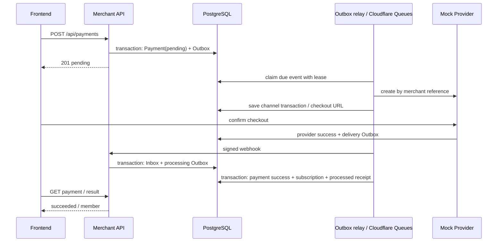
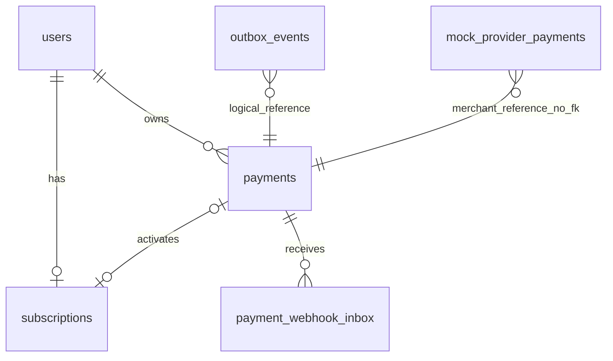

# Wellnest Backend

独立的 Python 后端仓库：FastAPI、Pydantic、SQLAlchemy 声明模型、PostgreSQL、Cloudflare Python Workers 和 Queues。前端在 `wellnest-frontend`。业务和测试使用 Python；Wrangler 本地运行与部署需要 Node.js。

## 启动

```bash
uv sync --locked --group deploy
npm ci
uv run python scripts/setup_payment_demo.py
docker compose --env-file .env.payments -f compose.payments.yml up -d --wait
uv run --group deploy python scripts/dev_workers.py
# 另一个终端
uv run python scripts/payment_smoke.py
```

API / OpenAPI：`http://127.0.0.1:18090/docs`。Compose 是独立的本地演示环境，数据库名 `wellnest_test`，持久化卷不会影响旧项目。凭据随机生成到被 Git 忽略的 `.env.payments`，不要提交它。前端开发默认 `http://127.0.0.1:5174`。

Compose 只运行本地 PostgreSQL；启动脚本迁移数据库、生成被忽略的 `.dev.vars`，然后启动 workerd 和 Miniflare 的真实队列处理入口。不再运行 RabbitMQ、Celery 或独立调度进程。需要 uv >= 0.12.3。真实支付渠道尚未接入。

## Cloudflare 部署

后端 Worker 为 `wellnest-backend`。前端仓库独立部署 `wellnest-assessment`，通过服务绑定反代 API，保留原站点 URL 和 Cookie。先部署并验证后端，再切换前端。

1. 配置 `wrangler.jsonc` 中 account、Hyperdrive、公开 URL 和可信 Origin。现有 Neon 上先执行追加迁移 `alembic upgrade head`；通过安全的本地环境提供数据库 URL。
2. 创建队列：`npx wrangler queues create wellnest-payments` 和 `npx wrangler queues create wellnest-payments-dead`。
3. 使用 `uv run --group deploy pywrangler secret put` 设置 `WELLNEST_PAYMENT_PROVIDER_KEY` 和 `WELLNEST_PAYMENT_WEBHOOK_SECRET`；启用 AI 时另设 `TYPESAFE_API_KEY`。不要将密钥提交 Git。
4. `npm run deploy:check` 检查打包，`npm run deploy` 发布。生产首次发布前需注入上述密钥；后续部署保留现有 secrets。
5. 用 `uv run python scripts/payment_smoke.py --base-url PUBLIC_ORIGIN` 验证部署后的真实闭环。

正常请求提交事务后由 `waitUntil` 尝试投递，队列处理完成后继续投递衍生事件。每 10 分钟 Cron 兜底扫描过期租约和 pending 支付，避免闲置时每秒查询 Neon。正常付款无需等 Cron；用户 refresh 也会触发立即查单投递。极端情况下投递中断后的自动恢复会有最多一个扫描周期的延迟。

Mock 渠道依然走独立 HTTP 协议和签名校验，Worker 内通过 `PAYMENT_API` 服务绑定调用同一部署的渠道路由，不穿过公网，不直接修改商户会员记录。

## 分层和事实归属

- `models`：Mapped 字段别名、Mixin、外键、唯一索引和 CHECK 约束；Alembic 独立版本迁移。
- `domain`：支付、订阅、Outbox、Inbox 各自的枚举和状态机；DTO 不依赖 HTTP。
- `repositories`：SQL 和持久化，服务控制事务边界。
- `services`：创建支付、回调接收、幂等落账、主动查单与渠道 Mock。
- `providers`：通过 HTTP 调用模拟支付平台；共享 HMAC 签名协议，不直接修改其数据库记录。
- `routers/schemas/dependencies`：请求验证、身份解析、依赖注入和响应白名单。

`mock_provider_payments` 是渠道自己的事实表，无业务支付表外键。Mock 收银台成功只能修改渠道记录并写 Outbox；商户会员只有回调处理或主动查单确认后才激活。

## 支付接口

所有业务路径都以 `/api` 开头；裸 `/pay` 已删除并返回 404。

| 方法和路径 | 鉴权与行为 |
|---|---|
| `POST /api/payments` | Session Cookie/Bearer + Idempotency-Key；创建 pending 支付，201 |
| `GET /api/payments/{id}` | 当前用户读取，不触发外部查询 |
| `POST /api/payments/{id}/refresh` | 当前用户请求后台查单，202；去重并限频 |
| `POST /api/webhooks/payments/mock` | 时间戳 + HMAC-SHA256；持久化通知及处理事件后返回 200 |
| `POST /api/mock-provider/payments` | Provider Bearer key；按商户支付单号幂等创建渠道交易 |
| `GET /api/mock-provider/payments/{merchant_payment_id}` | Provider Bearer key；查询渠道事实，查无此单返回 404 |
| `GET /api/mock-checkout/{token}` | 高熵能力令牌；读取模拟收银台 JSON |
| `POST /api/mock-checkout/{token}/confirm` | 高熵能力令牌；模拟成功或失败；过期交易保持 closed |

商户请求 `{ "planId": "wellnest-demo" }`；不接受 userId、金额或币种。价格配置以最小货币单位保存到支付快照。当前是单套餐、单 Mock 渠道、一次开通，无自动续费、退款、折扣或订阅到期。

```json
{
  "id": "<payment UUID>",
  "planId": "wellnest-demo",
  "status": "pending",
  "amountMinor": 990,
  "currency": "CNY",
  "checkoutUrl": null,
  "nextAction": "wait",
  "simulated": true,
  "createdAt": "<timestamp>",
  "updatedAt": "<timestamp>"
}
```

支付成功调用顺序：先完成测评；POST payments；GET 轮询直到 `nextAction=open_checkout`；对 checkoutUrl 加 `/confirm` 发 `{ "outcome":"succeeded" }`；GET payments 直到 succeeded；再读取测评 result。`scripts/payment_smoke.py` 是可直接重放的完整调用示例。

相同幂等键和请求返回原始创建快照（可能仍是 pending），最新状态以 GET 为准；同用户、套餐同时只允许一笔 pending。支付终态后可重新尝试；已有会员不再创建新支付。

渠道接口和通知使用独立的 snake_case 协议，和商户 camelCase API 分开。通知签名是 `HMAC_SHA256(secret, timestamp + '.' + raw_body)`；头为 `X-Payment-Timestamp`、`X-Payment-Signature`。通知包含 event_id、merchant_payment_id、transaction_id、amount_minor、currency、status、checkout_url、expires_at。通知 ID 去重，重用 ID 改正文返回 409；异常金额/交易号拒绝落账。

## 状态和一致性



- Payment：pending → succeeded / failed / closed；网络超时保持 pending。已成功不能被旧 pending 或失败通知降级。
- Subscription：inactive → active，重复激活幂等。支付成功、权益开通、处理回执同事务。
- Outbox：pending / published / failed，独立的 processed_at 表示业务处理完成。发布确认不等于处理完成。
- Inbox：pending → processed / rejected，独立处理结果。通知先可靠落库，外部 HTTP 在事务外执行。
- 终态冲突通知先查渠道；仍冲突则保留原终态并记录 rejected，不能自动推翻已经开通的权益。
- Relay 用 `FOR UPDATE SKIP LOCKED` 和租约领取；发布 Queues 成功后记录 published。消息只含版本、event_id、lease_token，业务指令仍从数据库读取。旧租约消息不能执行重新投递或人工重放后的事件。
- 队列入口在业务提交后 ACK。执行失败持久化错误和有限重试预算、延长租约，再由 Queues 延迟重试；数据库不可用时不 ACK。重复或已完成消息幂等 ACK。发布确认不能覆盖 failed 或完成回执。
- 业务重试预算耗尽后在 Outbox 留下 failed 记录。损坏消息或基础设施故障导致队列重试耗尽时进入 dead-letter queue；数据库未完成任务仍可由 Cron 恢复。全局执行超时短于租约，防止无限运行。
- 发布/处理重试预算耗尽后标为 failed，保留证据和重放入口。pending 支付按数据库 next_check_at 持续查单；查无此单时用同一商户引用幂等重建渠道交易。
- 金额不使用浮点；会员不由前端或 Mock 收银台直接设置。

```bash
# 在受控运维环境配置 WELLNEST_DATABASE_URL 和 PYTHONPATH=src 后运行
uv run python scripts/payment_outbox.py
uv run python scripts/payment_outbox.py --requeue EVENT_UUID
```

## 数据库关系



Outbox 的 aggregate_id 也可指向 Inbox 通知或渠道交易，因此不设置单一外键。`e50921_payments` 只新增表和 subscriptions.source_payment_id；历史 `mock_payments` 和既有会员完整保留，历史来源字段允许 NULL。降级会丢弃新增支付历史，生产应恢复备份，不能把 downgrade 当成无损回滚。

## 测试与契约

```bash
uv run ruff check src tests migrations scripts
uv run pytest
uv run python scripts/generate_frontend_contract.py --check
```

默认 pytest 使用独立 PostgreSQL Testcontainers；也可设置 WELLNEST_TEST_DATABASE_URL，数据库名必须为 wellnest_test。覆盖原测评逻辑、权限、并发、模型与迁移一致性，以及支付重复/丢失通知、HMAC、金额校验、越权、创建超时、查单竞争、事务回滚、租约恢复和有限重试。队列测试另覆盖发布响应丢失、旧租约消息、提交后重复投递、重试耗尽、数据库不可用及损坏消息隔离。

CI 运行 pytest、契约检查、Worker 打包，再启动真实 workerd / Miniflare 队列模拟器执行黑盒支付。该验证覆盖 Worker SDK 和 HTTP 服务绑定，但不等同于生产 Cloudflare 队列验证；线上需另外运行 smoke。第一次适配中发现的 SDK queue 参数差异通过本地运行时验证修正。

未实现真实渠道验签规范、退款/续费、跨区域容灾和压测，因为本次交付是单渠道演示闭环。

运行 `uv run python scripts/generate_frontend_contract.py` 生成 `contracts/`：OpenAPI、TypeScript DTO、规则分支样本及 SHA256 manifest。提交后前端按固定 commit 同步该目录并校验，前端 build 不需要 Python 或后端源码。

前端可以同源反代 `/api` 到独立后端；也支持 VITE_API_ORIGIN + WELLNEST_ORIGIN（精确来源、携带 Cookie）。跨站域名需另行设计 Cookie 策略，本版默认 same-site/session 配置。

## 地域与请求耗时

Neon PostgreSQL 使用新加坡 `aws-ap-southeast-1`，Hyperdrive 连接该实例；后端 Worker 通过 `placement.region = aws:ap-southeast-1` 在靠近数据库的 Cloudflare 节点执行。前端静态资源保留边缘分发，动态请求通过服务绑定进入后端。Cloudflare Queues 属于平台托管服务，未宣称队列存储和所有事件处理固定在新加坡。


2026-09-21 的对照实验保持 6 次业务数据库调用及事务不变，仅将 Worker 靠近原俄亥俄数据库：PATCH 的查询等待从约 1.2 秒降至约 0.3 秒。代表性只读 SQL 的 `EXPLAIN ANALYZE` 执行时间为 0.04–0.10 毫秒，支持优先调整网络地域，未为此合并 SQL 或破坏事务边界。随后迁移到新加坡，保留原库只读存档；切换前按表核对行数与完整内容摘要。切换后已有新写入，不能只改回旧连接就当作无损回滚。

Queue and Cron forward through authenticated Service Binding HTTP fetch to the Singapore-placed backend. They never connect to PostgreSQL directly. Configure the independent `WELLNEST_PAYMENT_INTERNAL_KEY` secret before deployment. Internal endpoints are excluded from OpenAPI and fail closed without credentials. ACK follows committed execution; transport failures retry the same event and lease with existing Outbox fencing and recovery.

## Cloudflare 可观测性

FastAPI、HTTPX、asyncpg 的标准 OpenTelemetry Instrumentor 在 `app/telemetry.py` 统一注册。业务服务不创建手工 span。服务绑定使用官方 `AsyncOpenTelemetryTransport`；Outbox 保存 W3C `traceparent`，Queue 适配器负责上下文传递，延迟投递和重试仍接续原 trace。

Workers 使用不需要后台线程的 `SimpleSpanProcessor`，将 SDK span 输出为 JSON 日志。打开 `wellnest-backend → Observability → Logs`，用响应头 `X-Trace-ID` 筛选字段 `trace_id`，再筛选 `event = otel.span`。记录包含 `span_id`、`parent_span_id`、`duration_ms`、开始/结束时间和状态。应用日志附带当前 trace/span ID。SQL 只导出操作名和指纹，不输出 SQL 正文、参数、URL、请求头或异常消息。

支付确认 trace 连接 confirm → Outbox → Queue → 内部 HTTP → webhook → Queue → 权益写入。浏览器轮询和结果读取是独立请求；Outbox 扫描 SQL 也有自身 span，事件执行通过持久化上下文接续。`messaging.delivery.age_ms` 包含重试等待，不等同于纯队列等待。

Cloudflare 原生 Traces 仍显示平台调用；Python SDK span 存在 Logs 中，并未导入原生 Traces 瀑布图。演示使用全量应用采样及平台日志/trace 采样，查询仍受平台保留期、日志限制及导出失败影响。

测试覆盖并发隔离、SQL 父子关系、自定义 HTTP transport 传播、延迟 Outbox 关联、敏感字段过滤和导出失败不影响业务。`uv run python scripts/payment_smoke.py --base-url <URL>` 验证支付闭环并输出 `confirmationTraceId`。

打包使用 uv 0.12.17（与 CI 一致）；旧版 0.10.9 无法解析当前 Pyodide wheel tag。
