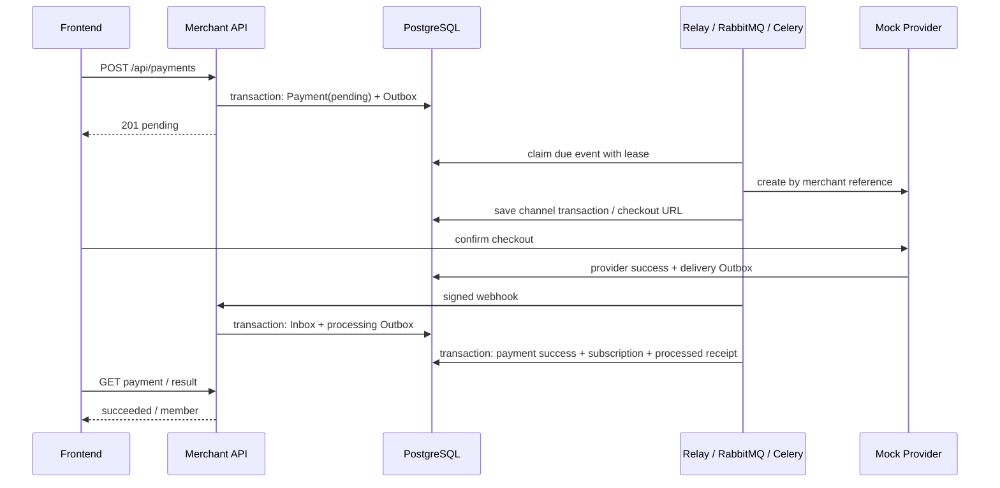
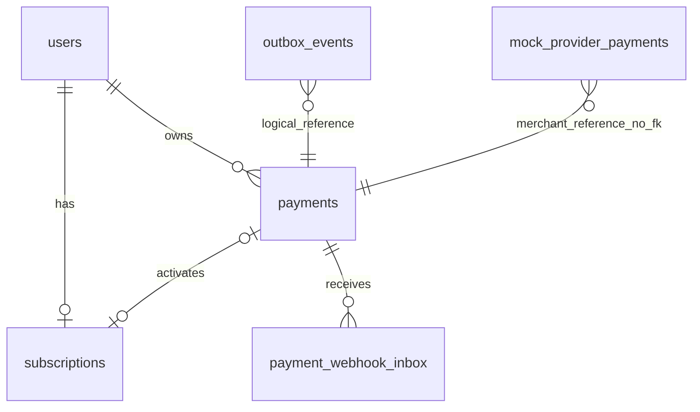

# Wellnest Backend

独立的 Python 后端仓库：FastAPI、Pydantic、SQLAlchemy 声明模型、PostgreSQL、RabbitMQ、Celery。前端在 `wellnest-frontend`。本仓库不需要 Node.js，也不从前端目录导入文件。

## 启动

```bash
uv sync --locked
uv run python scripts/setup_payment_demo.py
docker compose --env-file .env.payments -f compose.payments.yml up -d --build
uv run python scripts/payment_smoke.py
```

API / OpenAPI：`http://127.0.0.1:18090/docs`。Compose 是独立的本地演示环境，数据库名 `wellnest_test`，持久化卷不会影响旧项目。凭据随机生成到被 Git 忽略的 `.env.payments`，不要提交它。前端开发默认 `http://127.0.0.1:5174`。

`api`、`worker`、`scheduler` 使用同一镜像；`migrate` 先运行 Alembic，再启动业务进程。生产需单独配置 PostgreSQL、RabbitMQ、HTTPS、可信前端 Origin、Provider 地址和共享密钥。真实支付渠道尚未接入。此次不自动替换旧 Cloudflare 线上部署。

## 分层和事实归属

- `models`：Mapped 字段别名、Mixin、外键、唯一索引和 CHECK 约束；Alembic 独立版本迁移。
- `domain`：支付、订阅、Outbox、Inbox 各自的枚举和状态机；DTO 不依赖 HTTP。
- `repositories`：SQL 和持久化，服务控制事务边界。
- `services`：创建支付、回调接收、幂等落账、主动查单与渠道 Mock。
- `providers`：通过 HTTP 调用模拟支付平台；共享 HMAC 签名协议，不直接修改其数据库记录。
- `routers/schemas/dependencies`：请求验证、身份解析、依赖注入和响应白名单。

`mock_provider_payments` 是渠道自己的事实表，无业务支付表外键。Mock 收银台成功只能修改渠道记录并写 Outbox；商户会员只有回调处理或主动查单确认后才激活。

## 支付接口

所有业务路径都以 `/api` 开头；裸 `/pay` 已删除并返回 404。

| 方法和路径 | 鉴权与行为 |
|---|---|
| `POST /api/payments` | Session Cookie/Bearer + Idempotency-Key；创建 pending 支付，201 |
| `GET /api/payments/{id}` | 当前用户读取，不触发外部查询 |
| `POST /api/payments/{id}/refresh` | 当前用户请求后台查单，202；去重并限频 |
| `POST /api/webhooks/payments/mock` | 时间戳 + HMAC-SHA256；持久化通知及处理事件后返回 200 |
| `POST /api/mock-provider/payments` | Provider Bearer key；按商户支付单号幂等创建渠道交易 |
| `GET /api/mock-provider/payments/{merchant_payment_id}` | Provider Bearer key；查询渠道事实，查无此单返回 404 |
| `GET /api/mock-checkout/{token}` | 高熵能力令牌；读取模拟收银台 JSON |
| `POST /api/mock-checkout/{token}/confirm` | 高熵能力令牌；模拟成功或失败；过期交易保持 closed |

商户请求 `{ "planId": "wellnest-demo" }`；不接受 userId、金额或币种。价格配置以最小货币单位保存到支付快照。当前是单套餐、单 Mock 渠道、一次开通，无自动续费、退款、折扣或订阅到期。

```json
{
  "id": "<payment UUID>",
  "planId": "wellnest-demo",
  "status": "pending",
  "amountMinor": 990,
  "currency": "CNY",
  "checkoutUrl": null,
  "nextAction": "wait",
  "simulated": true,
  "createdAt": "<timestamp>",
  "updatedAt": "<timestamp>"
}
```

支付成功调用顺序：先完成测评；POST payments；GET 轮询直到 `nextAction=open_checkout`；对 checkoutUrl 加 `/confirm` 发 `{ "outcome":"succeeded" }`；GET payments 直到 succeeded；再读取测评 result。`scripts/payment_smoke.py` 是可直接重放的完整调用示例。

相同幂等键和请求返回原始创建快照（可能仍是 pending），最新状态以 GET 为准；同用户、套餐同时只允许一笔 pending。支付终态后可重新尝试；已有会员不再创建新支付。

渠道接口和通知使用独立的 snake_case 协议，和商户 camelCase API 分开。通知签名是 `HMAC_SHA256(secret, timestamp + '.' + raw_body)`；头为 `X-Payment-Timestamp`、`X-Payment-Signature`。通知包含 event_id、merchant_payment_id、transaction_id、amount_minor、currency、status、checkout_url、expires_at。通知 ID 去重，重用 ID 改正文返回 409；异常金额/交易号拒绝落账。

## 状态和一致性



- Payment：pending → succeeded / failed / closed；网络超时保持 pending。已成功不能被旧 pending 或失败通知降级。
- Subscription：inactive → active，重复激活幂等。支付成功、权益开通、处理回执同事务。
- Outbox：pending / published / failed，独立的 processed_at 表示业务处理完成。发布确认不等于处理完成。
- Inbox：pending → processed / rejected，独立处理结果。通知先可靠落库，外部 HTTP 在事务外执行。
- 终态冲突通知先查渠道；仍冲突则保留原终态并记录 rejected，不能自动推翻已经开通的权益。
- Relay 用 `FOR UPDATE SKIP LOCKED` 和租约领取；RabbitMQ durable 队列、持久化任务及 publisher confirm；投递至少一次。崩溃或消息丢失时，未处理事件租约到期重新投递。
- Celery 关闭此单 worker 方案不需要的 remote control、gossip/mingle，避免 RabbitMQ 4.3 禁止的临时非独占队列（参见 https://www.rabbitmq.com/docs/queues）。任务仍使用持久化队列。
- Celery 使用 late ACK、worker-lost redelivery、网络超时和任务时间限制。以数据库 processed_at 和业务锁处理重复，不依赖 Celery result backend。
- 发布/处理重试预算耗尽后标为 failed，保留证据和重放入口。pending 支付按数据库 next_check_at 持续查单；查无此单时用同一商户引用幂等重建渠道交易。
- 金额不使用浮点；会员不由前端或 Mock 收银台直接设置。

```bash
docker compose --env-file .env.payments -f compose.payments.yml exec worker python scripts/payment_outbox.py
docker compose --env-file .env.payments -f compose.payments.yml exec worker python scripts/payment_outbox.py --requeue EVENT_UUID
```

## 数据库关系



Outbox 的 aggregate_id 也可指向 Inbox 通知或渠道交易，因此不设置单一外键。`e50921_payments` 只新增表和 subscriptions.source_payment_id；历史 `mock_payments` 和既有会员完整保留，历史来源字段允许 NULL。降级会丢弃新增支付历史，生产应恢复备份，不能把 downgrade 当成无损回滚。

## 测试与契约

```bash
uv run ruff check src tests migrations scripts
uv run pytest
uv run python scripts/generate_frontend_contract.py --check
```

默认 pytest 使用独立 PostgreSQL Testcontainers；也可设置 WELLNEST_TEST_DATABASE_URL，数据库名必须为 wellnest_test。覆盖原测评逻辑、权限、并发、模型与迁移一致性，以及支付重复/丢失通知、HMAC、金额校验、越权、创建超时、查单竞争、事务回滚、租约恢复和有限重试。集成测试直调任务处理器并走真实 HTTP 协议；`payment_smoke.py` 另行验证真实队列和常驻进程，不能混称为同一种验证。

未实现真实渠道验签规范、退款/续费、跨区域容灾和压测，因为本次交付是单渠道演示闭环。

运行 `uv run python scripts/generate_frontend_contract.py` 生成 `contracts/`：OpenAPI、TypeScript DTO、规则分支样本及 SHA256 manifest。提交后前端按固定 commit 同步该目录并校验，前端 build 不需要 Python 或后端源码。

前端可以同源反代 `/api` 到独立后端；也支持 VITE_API_ORIGIN + WELLNEST_ORIGIN（精确来源、携带 Cookie）。跨站域名需另行设计 Cookie 策略，本版默认 same-site/session 配置。
